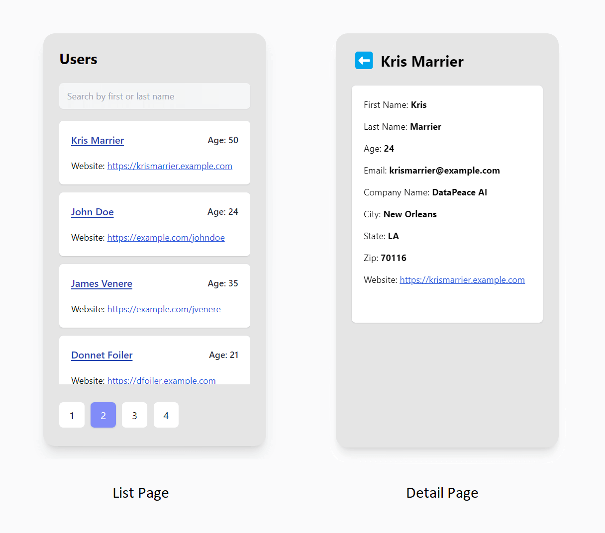

# React Native Assignment

In this assignment, you have to create a mobile application using react-native framework which provides following functionalities:

- list users
- search for a user in list
- pagination of users list
- detail page for each user

_Attention to detail and meeting all requirements is important in the project. Completing it in less time will not give you any preference._

## **Task Overview**

App functions:

- **List Users:** The main screen should list all users
  - fields to be shown in card: `first_name`, `last_name`, `age` and `web`
  - clicking on first name should open `Details` page
  - website links (`web`) should open in a browser
- **Search**: Allow to **search** using first_name or last_name
- **Pagination**: Data in users List should be paginated
- **Detail**: Detail page should show all fields of user
  - Clicking on **back** navigates back to users List page

## API endpoint:

_[https://datapeace-storage.s3-us-west-2.amazonaws.com/dummy_data/users.json](https://datapeace-storage.s3-us-west-2.amazonaws.com/dummy_data/users.json)_

The user model has following fields:

```tsx
User -
  id -
  first_name -
  last_name -
  age -
  email -
  web -
  company_name -
  city -
  state -
  zip;
```

## **Instructions**

- [ ] Use the **react-native** framework for this assignment.
- [ ] **IMPORTANT**: Pagination, search etc. should be implemented manually in the frontend only. **DO NOT** use 3rd party library or inbuilt feature for these.
- [ ] Data should be _fetched_ from the [api provided](https://datapeace-storage.s3-us-west-2.amazonaws.com/dummy_data/users.json) (and not stored in source code)
- [ ] `yarn start-android` (or `npm run start-android` if using npm) should start the app in connected device or emulator. Similarly for ios.
- [ ] repo should not contain irrelevant folders/files like node_modules, build directories etc.
- [ ] Follow the [wireframes](#wireframes) provided closely
- [ ] Follow these steps for submission:
  1. Clone the repository
  1. Create issues and work on them in their respective branches
  1. Complete the tasks while following all instructions
  1. Create MRs and merge into main branch
  1. When done, Test if all task requirements are met and instructions followed
  1. Push code to github
  1. Share your **repo url** and **apk** on email [careers@datapeace.in](mailto:careers@datapeace.in)

## Wireframes:

Wireframes for users list screen _(left)_ and user detail screen _(right)_

